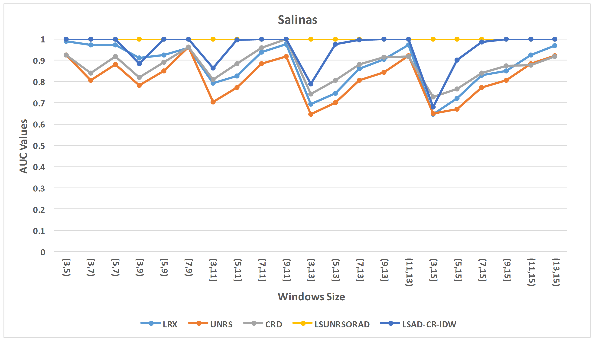

# Anomaly Detection for Hyperspectral Imagery Based on the Regularized Subspace Method and Collaborative Representation
This is the matlab code for hyperspectral anomaly detection (LSAD-CR-IDW and LSUNRSORAD algorithms)

For more information of this project, please refer to our paper: 

[Kun Tan, Zengfu Hou, Fuyu Wu,Qian Du, and Yu Chen. Anomaly Detection for Hyperspectral Imagery Based on the Regularized Subspace Method and Collaborative Representation. Remote Sensing 2019.](https://www.mdpi.com/2072-4292/11/11/1318) [Co-first author]

# Prerequisites
matlab R2018b



Fig.1. AUC values of different window sizes in the Salinas dataset


# Citation
If these codes and dataset are helpful for you, please cite this paper:


**BibTex Format:**<br />
```
@article{tan2019anomaly,
  title={Anomaly detection for hyperspectral imagery based on the regularized subspace method and collaborative representation},
  author={Tan, Kun and Hou, Zengfu and Wu, Fuyu and Du, Qian and Chen, Yu},
  journal={Remote sensing},
  volume={11},
  number={11},
  pages={1318},
  year={2019},
  publisher={Multidisciplinary Digital Publishing Institute}
}
```

**Plain Text Format:**<br />
```
Tan, K., Hou, Z., Wu, F., Du, Q. and Chen, Y., 2019. Anomaly detection for hyperspectral imagery based on the regularized subspace method and collaborative representation. Remote sensing, 11(11), p.1318.
```

# Other Related Papers
[1] Kun Tan, **Zengfu Hou**, Dongelei Ma, Yu Chen, and Qian Du. [Anomaly detection in hyperspectral imagery based on low-rank representation incorporating a spatial constraint](https://www.mdpi.com/2072-4292/11/13/1578) [J]. Remote Sensing, 2019, 11(13): 1578. [Co-first author]

[2] **Zengfu Hou**, Wei Li, Ran Tao, Pengge Ma, and Weihua Shi. [Collaborative Representation with Background Purification and Saliency Weight for Hyperspectral Anomaly Detection](https://engine.scichina.com/publisher/scp/journal/SCIS/doi/10.1007/s11432-020-2915-2?slug=abstract) [J]. SCIENCE CHINA Information Sciences. 2020.

[3] Jun Liu, **Zengfu Hou**, Wei Li, Ran Tao, Danilo Orlando and Hongbin Li. [Multipixel Anomaly Detection With Unknown Patterns for Hyperspectral Imagery](https://ieeexplore.ieee.org/abstract/document/9404853) [J]. IEEE Transactions on Neural Networks and Learning Systems, doi: 10.1109/TNNLS.2021.3071026. [Second author]

[4] **Zengfu Hou**, Wei Li, Lianru Gao, Bing Zhang, Pengge Ma, and Junlin Sun. [A BACKGROUND REFINEMENT COLLABORATIVE REPRESENTATION METHOD WITH SALIENCY WEIGHT FOR HYPERSPECTRAL ANOMALY DETECTION](https://ieeexplore.ieee.org/abstract/document/9324521) [C]. International Geoscience and Remote Sensing, 2020. [Oral]

[5] **Zengfu Hou**, Yu Chen, Kun Tan, and Peijun Du. [NOVEL HYPERSPECTRAL ANOMALY DETECTION METHODS BASED ON UNSUPERVISED NEAREST REGULARIZED SUBSPACE](https://pdfs.semanticscholar.org/43ba/4ca04679165d72e9f3fd3a9b1346437b81f9.pdf) [C]. International Archives of the Photogrammetry, Remote Sensing & Spatial Information Sciences, 2018, 42(3)

[6] **Zengfu Hou**, Kun Tan, Yu Chen, and Peijun Du. [AN IMPROVED UNSUPERVISED NEAREST REGULARIZED SUBSPACE METHOD FOR HYPERSPECTRAL ANOMALY DETECTION](https://drive.google.com/file/d/1g3KkwsN2Q8pk7aMZEKGRdfoGEEcOTTRp/view) [C]. International Conference on Advanced Remote Sensing, 2018.


# Website
1.Github Website: [https://zephyrhours.github.io/](https://zephyrhours.github.io/)

2.Chinese CSDN Blog: [https://blog.csdn.net/NBDwo](https://blog.csdn.net/NBDwo)

# Contact
If you have any other questions, you can send it to my email (See Github Website). I will get back to you as soon as possible!
